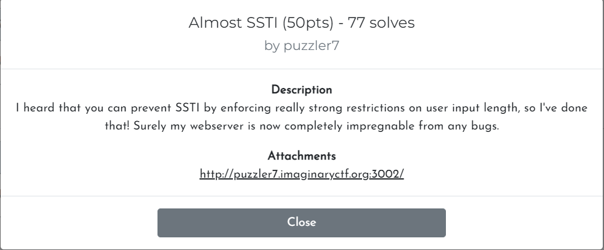
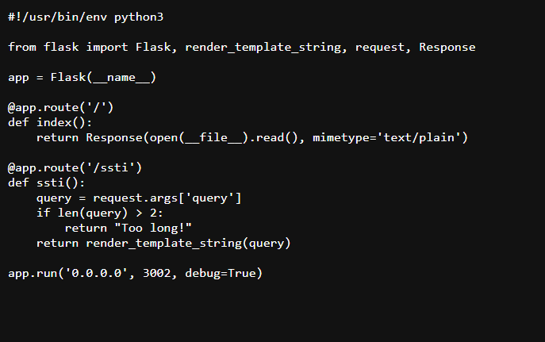
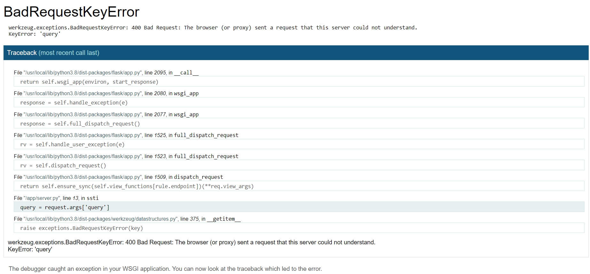
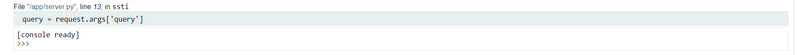
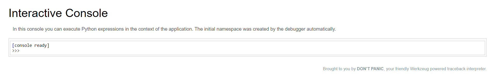
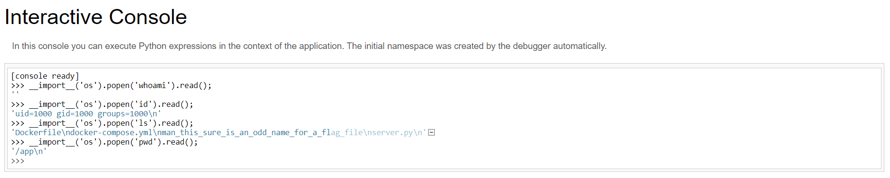

# ALMOST SSTI [imaginaryctf](https://imaginaryctf.org/Challenges) (50 Pts)
## Thông tin và mở rộng cho SSTI [Link](https://github.com/Xeus-Territory/research_hacking/tree/main/SSTI)
## Language:
1. [Tiếng việt](#i-cấu-trúc-câu-hỏi)
2. [English](#to-be-continued)

---
# I. Cấu trúc câu hỏi:
 
***Lời dẫn (tạm dịch): Nó bảo là nó có thể ngăn SSTI trên web nó bằng cách nó hạn chế nhập thông tin vào của người dùng, nó đảm bảo rằng sẽ có bug nào trên web nó cả*** :raised_hands:   
***Đính kèm: [Link to web](http://puzzler7.imaginaryctf.org:3002/)*** 

1. Click vào đường dẫn ta sẽ được trả về với route đầu tiên (@app.route('/'))) 
 
-   Nhận diện dược đây là code Flask (Các thư viện import là lý do).
-   Có 2 route trong bài này đó là route (/) ta đang đứng và route (/ssti)
-   Đặc điểm nhận dạng của bài SSTI đối với python cụ thể jinja2 đó là ***render_template_string()*** cụ thể câu lệnh này xuất hiện trong route (/ssti), trong đó còn một đặc điểm nữa trong route này cậu lệnh get argument còn cho ta hiểu rằng sẽ có dữ liệu sẽ được lấy vào và check 
-   Một dấu hiệu cuối cùng của việc Flask đó là cho ta tính năng debug, theo code thì debug đang ở mode on tức là true thì thằng Flask nó có một khuyến cáo ***"The debugger allows executing arbitrary Python code from the browser. It is protected by a pin, but still represents a major security risk. Do not run the development server or debugger in a production environment."*** (nôm na là nó bảo là khi mày bật debug đối với template này thì người dụng họ sẽ có thể thực thi bất cứ câu lệnh python nào, nó bảo là có được bv bởi số pin nhưng mà vẫn rủi ro nên là không nên bật mode debug nếu nó trên product) :cold_sweat:
## So that all, tất cả mọi thông tin mà ta còn có thể đọc từ code ==> giờ tiếp theo ta vọc thử xem nó có gì 

# II. Khai thác (Exploit):
Đầu tiên ta sẽ đến với cái route (/ssti) thì thử gõ một cái url với ssti xem nó báo lỗi gì (có lỗi chớ vì nó yêu cầu cái query mà mình không truyền vào :disappointed:) :

    http://puzzler7.imaginaryctf.org:3002/ssti

-   Trước hết trong framework web của python (có 2 cái to to : Django + Flask) nó có tích hợp một nền tảng hoặc là quy ước [WGSI](https://en.wikipedia.org/wiki/Web_Server_Gateway_Interface) nôm na là điều hướng để forward các request từ web server tới web application hoặc các framework của python (nhiều ngôn ngữ khác nữa không chỉ riêng python), trong cái wiki nó có viết một cái WGSI ***"WSGI was thus created as an implementation-neutral interface between web servers and web applications or frameworks to promote common ground for portable web application development"*** (có thể hiểu là WGSI nó là interface trung lập giữa web server và web app để thúc đẩy nền tảng cho sự phát triển).
-   Okay sau khi ta biết wgsi là gì thì ta có thể xem trong cái debug mà chương trình nó đổ ra ta có thể thấy flask nó dùng một cái wgsi tên werkzeug và cái điều hướng cũng như về proxy thì nó làm và werkzeug là một wsgi được tính hợp sẵn trong flask, theo debug nó đổ về một cái traceback (cây lỗi) và nó báo xám tại cái dòng bị lỗi trong code ở đây ra có thể khai thác được 2 thứ
 
-   Theo như cái hình ta có thể thấy được là werkzeug nó cho ta debug trực tiếp code đó trên web luôn :clap:, điểu đó có thể hiểu là việc bật debug này nó cho phép ta mở một console code trực tiếp để thực thi code python ngay trên web. Như nó nói thì có thể click vào cái icon ngày bên cạnh cái dòng lỗi ở cái traceback hoặc là ta có thể trực tiếp vào console thông qua route(/console)
---
    http://puzzler7.imaginaryctf.org:3002/console
-   [Werkzeug exploit](https://book.hacktricks.xyz/network-services-pentesting/pentesting-web/werkzeug) đây là một trang ta có thể xem được các thông tin mà ta khai thác được đối với WGSI này. Trong một cái trường hợp thì tụi nó có một cách để khóa ta lại nó là dùng mã PIN (như đã nói ở trên mã PIN không tuyệt đối an toàn và mã pin bằng cách mà cái link nó chỉ cách bẻ là reverse lại cái algo mà generating ra cái PIN đó), **Nhưng mà đối với bài này ta không cần phải nhập mà PIN vì nó được config với flask là không cần phải nhập debug pin và được phép tương tác trực tiếp với console này**.
 
 
-   Ta sẽ thử tương tác những câu lệnh để xem nó trả về cho ta được gì

-   Ta có thể thấy tương tác tốt với các command với máy chủ đầu tiên ta đi lấy cờ trước thì không hiểu chủ đích thể nào mà ta không có được file là flag mà họ lại đặt là man_this_sure_is_an_odd_name_for_a_flag_file (hơi bị 3 chấm ...) mà thôi cat file đó thì ta được
---
    >> __import__('os').popen('cat man_this_sure_is_an_odd_name_for_a_flag_file').read();
    'ictf{oops_I_left_my_debugger_on_I_need_to_run_home_before_my_webserver_burns_down}'

## Okay sau đây ta đã tìm được flag trong bài này ta có thể thấy được là để debug mode on trên web là risk thế nào. Nói chung là bài này có thể có cách giải khác hay không thì phải đợi writeup khác thử ... HappyHacking !!! :clap:

# III. Dockerfile và Dockercompose tậu về xài và mã nguồn để build lại:
    - 'FROM ubuntu:20.04
       RUN apt-get update -y && apt-get install -y python3-pip python3-dev
       WORKDIR /app
       RUN pip3 install flask
       COPY . /app
       RUN chmod 555 /app
       ENV WERKZEUG_DEBUG_PIN=off
       USER 1000:1000
       ENTRYPOINT [ "python3" ]
       CMD [ "server.py" ]'
    - "version: '3.3'
       services:\n  hostility:\n    deploy:\n      resources:\n        limits:\n          cpus: '0.     001'\n          memory: 50M\n        reservations:\n          cpus: '0.0001'\n          memory: 20M\n    build: .\n    network_mode: bridge\n    restart: always\n    ports:\n      - 3002:3002\n    cap_drop:\n      - all\n    cap_add:\n      - chown\n      - setuid\n      - setgid\n      - sys_admin\n    security_opt:\n      - apparmor=unconfined\n      - seccomp=unconfined\n"

## Mã nguồn lưu lại hồi không có mà tìm :grin:
    - #!/usr/bin/env python3

        from flask import Flask, render_template_string, request, Response

        app = Flask(__name__)

        @app.route('/')
        def index():
            return Response(open(__file__).read(), mimetype='text/plain')

        @app.route('/ssti')
        def ssti():
            query = request.args['query']
            if len(query) > 2:
                return "Too long!"
            return render_template_string(query)

        app.run('0.0.0.0', 3002, debug=True)
---
# To be continued